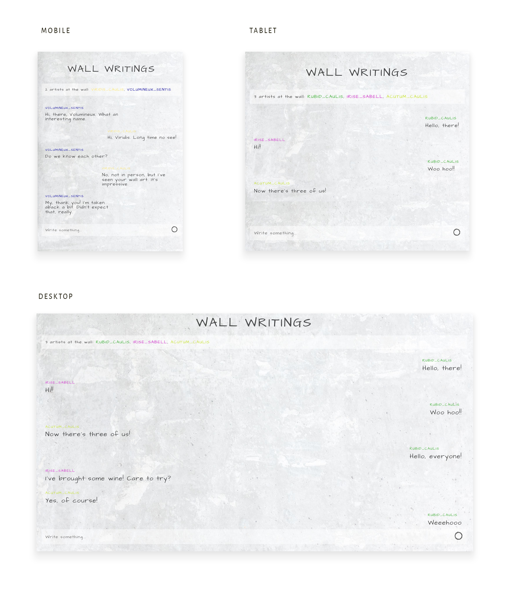

# CHAT APP

**Algebra Front-end Developer Course 2021 - final project**

This is the final project for the forementioned educational program.

<br>

---

<br>

## Technologies

<br>

- HTML5
- CSS3
- SCSS
- "vanilla" JavaScript
- [Scaledrone](https://www.scaledrone.com/)

<br><br>

---

<br>

## Features

<br>

- Sends messages with autor name
- Recognizes sender from the rest of the chat members by showing the messages on the right (sender) and on the left (others)
- Random nickname generator and random name color picker
- Connected to Scaledrone
- Displays active members and notifications who joined
- Autoexpanding input area with a scrollbar in case of a larger text input
- Displays date and time with the message
- Displays warning message when max message length reached
- Displays message when error while connecting to Scaledrone
- Responsive design

<br><br>

---

<br>

## Impovement ideas

<br>

- [x] limit number of characters in the form input field + alert message
- [x] add modal window when error while connecting
- [x] add date & time with every message sent
- [x] add small modal window with alert when character limit reached
- [x] add SCSS
- [x] make [version with Webpack](https://github.com/emarekica/chat-modularJS-webpack)

<br><br>

---

<br>

## Connect to Scaledrone

<br>

You can create your Scaledrone channel for free [here](https://dashboard.scaledrone.com/channels).
To connect to the channel you need to paste your channel ID in the `wall-chat.js`.
<br><br>

```js
// Connecting to Scaledrone channel ID
const CLIENT_ID = "M5tfM9H0WVkEzsTi";
```

<br><br>

---

<br>

## Mockup

<br><br>


<br><br>

---

<br>

## Try it

<br>

Open the chat in two or more different windows/tabs.

[GitHub Pages](https://emarekica.github.io/seminarski-algebra/)

---

### Licence

[MIT](https://choosealicense.com/licenses/mit/)
