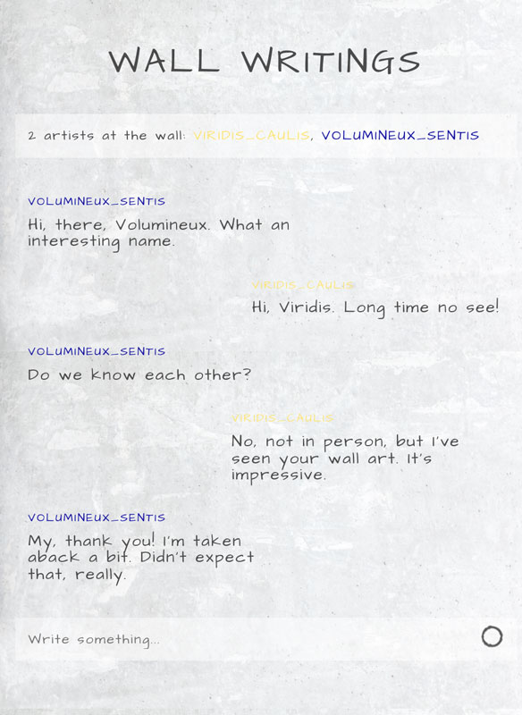
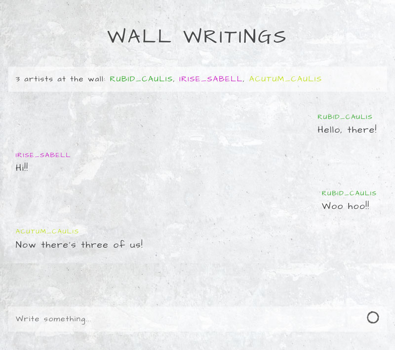
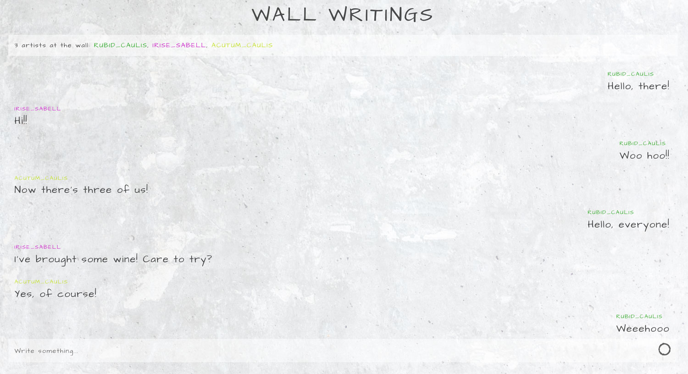

# CHAT APP

**Algebra Front-end Developer Course 2021 - final project**

This is a final project for forementioned education program.
___

## Technologies

- HTML
- CSS
- "Vanilla" JavaScript
- [Scaledrone](https://www.scaledrone.com/)

<br>
___

## Connect to Scaledrone

You can create your Scaledrone channel for free [here](https://dashboard.scaledrone.com/channels).
To connect to the channel you need to paste your channel ID in the `wall-chat.js`.

  ```js
  // Connecting to Scaledrone channel ID
  const CLIENT_ID = "M4trM8H1WVeEhszi";
  ```

<br>
___
## Features

- Sends messages with autor name
- Recognizes sender from the rest of the chat members by showing the messages on the right (sender) and on the left (others)
- Random nickname generator and random name color picker
- Connected to Scaledrone
- Displays active members and notifications who joined
- Autoexpanding input area with a scrollbar in case of a larger text input

<br>
___

## Image


<br>

<br>

<br>
___

## Try it yourself

Try it by opening in two different windows.

[GitHub Pages](https://github.com/emarekica/seminarski-algebra/settings/pages)


